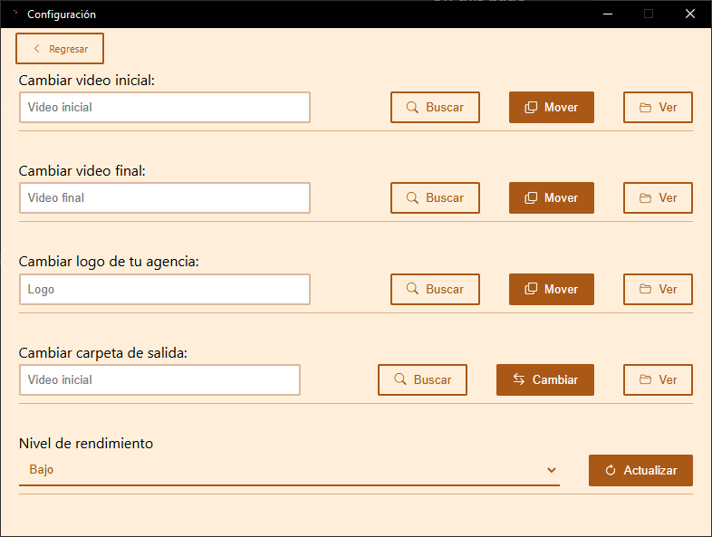

**Nefertari: Creador de videos** cuenta con diversas configuraciones, desde archivos multimedia hasta de rendimiento!

## Cambiar archivos multimedia

Todos los archivos puden ser cambiados sin problema, solo pega la ruta o busca el archivo a remplazar para cada una de las opciones!

## Cambiar carpeta de salida

La carpeta de salida puede ser cambiada sin problemas, solo pega la ruta o busca el directorio/carpeta!

:::caution[Importante]
Al cambiar de carpeta, los archivos que existan en el directorio **NO** se moverán, es decir, **los archivos que se encuentren dentro de la carpeta no se moverán a la nueva ubicación**
:::

## Rendimiento

El rendimiento pude ser cambiado para mejorar le eficacia de generación de videos!, por defecto, su valor es **bajo**

:::caution[Importante]
Por defecto, el rendimiento es _"bajo"_ y puede modificarse. **Recomendamos realizar diversas pruebas para adaptar el rendimiento a su sistema**
:::

:::danger[Peligro]
Si selecciona un rendimiento mayor en un dispositivo de menor gama, **es muy probable que surgan problemas con los videos finales o renderizados**.

Para estos casos, **intenta bajar el rendimiento al más optimo para tu sistema**.
:::

