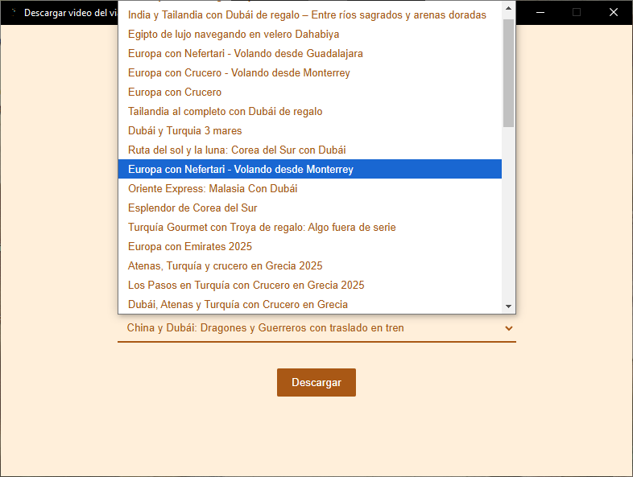
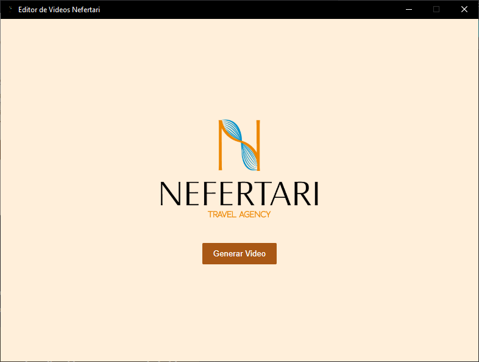
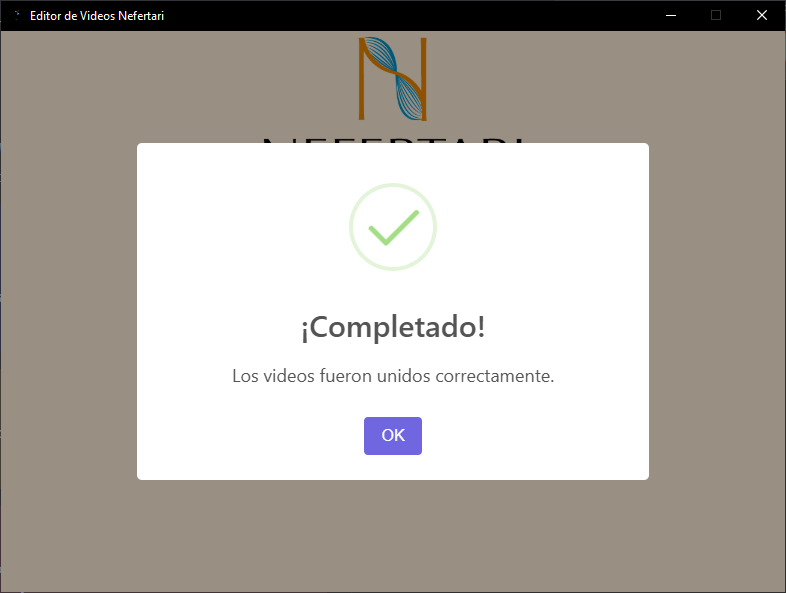
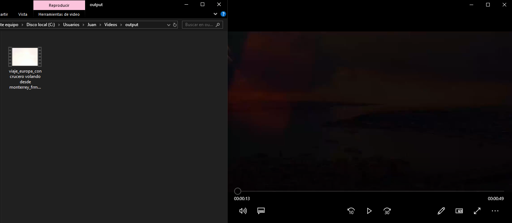

Ha llegado el momento de editar el primer video, ya con la instalación y las configuraciones realizadas, ¡ahora será mucho más sencillo esta parte del proceso!

## Descargar video a editar

Antes de editar, ¡es necesario descargar un video de la lista!, este proceso puede demorar algun tiempo debido al rendimiento.

:::note[Nota]
El tiempo de espera _(rendimiento)_ pueden modifcarse desde la [configuración](/fucionalidades/configuracion)!
:::

:::caution[Importante]
Si la aplicación es cerrada durante el proceso de descarga, **la aplicación no reconocerá el video en el proximo inicio de sesión**
:::

## Generar video final

Una vez descargado el video a editar, es momento de generar el video. **Con solo darle click** al botón de "generar video", ¡Nefertari: Editor de videos hará todo el proceso!

:::caution[Importante]
Si la aplicación es cerrada durante el proceso de descarga, **la aplicación no reconocerá el video en el proximo inicio de sesión**
:::

## ¡Y listo!

Una vez terminado todo el proceso, _Nefertari: Editor de Videos_ abrirá de manera automatica la ubicación del archivo en el explorador de archivos, ¡así como reproducir el video final!

:::note[Nota]
Al finalizar, el programa se colocará en la ventana de descarga de videos!. **Los videos una vez finalizados no se eliminarán de la carpeta de salida**, la cual se puede cambiar en [configuración](/funcionalidades/configuracion).
:::

