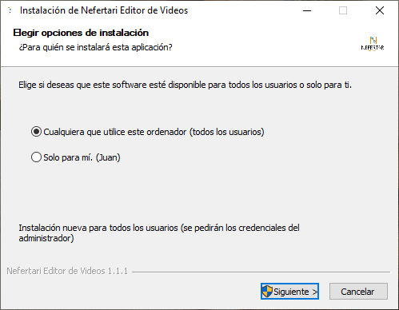
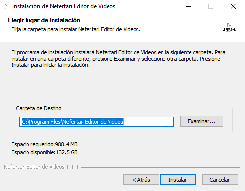
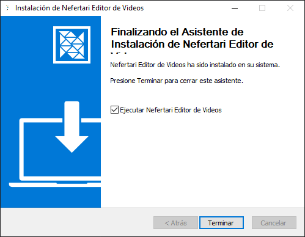

Nefertari: Creador de videos se puede instalar para sistemas operativos con arquitectura de 64 bits y es multiplataforma, el archivo de instalación lo puedes descargar [a traves de este enlace](#)

## Abriendo el archivo setup

##### (Solo en Windows)

Al abrir el archivo _Nefertari Editor de Videos Setup.exe_ es necesario seleccionar para que usuarios instalar el programa, (en la cuenta que se esta usando y para todos los usuarios).
:::note[Nota]
En caso de seleccionar "todos los usuarios" se pedirá permisos de administrador para su instalación.
:::

En la instalación, se requiere seleccionar una carpeta o ruta para los archivos del programa

:::note[Nota]
El programa pedirá permisos de administrador independientemente de la ruta selecciona
:::

¡Y listo!, el programa se ha instalado correctamente en su sistema.

