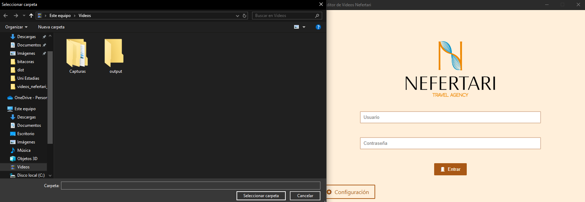

Una vez instalado _Nefertari: Editor de Videos_, es necesario configurar algunos recursos importantes para una mejor experiencia de uso.

## Importar recursos multimedia

Al entrar por primera vez, aparecerá una notificación informando sobre los recursos necesarios de importar, esto para utilizar _Nefertari: Editor de Videos_

## Carpeta Raíz

Se abrirá un cuadro de dialogo para seleccionar la _carpeta raíz_

:::note[Nota]
Si se cancela el cuadro de dialogo, volverá a pedir una nueva ubicación. **Esto se puede cambiar en las configuraciones del programa**
:::

## Inicio de sesión

Para utilizar _Nefertari: Editor de videos_, es necesario contar con un cuenta en [salon nefertari](https://www.salonnefertaritravel.com/#/login)

:::note[Nota]
Será necesario iniciar sesión cada vez que se inicia la aplicación
:::

:::caution[Importante]
Además de contar con una cuenta del **salon nefertari**, es necesario tener el permiso de generar videos con su branding, si su cuenta no tiene esta caracteristica, no tendrá acceso al editor.
:::

### Archivos Faltantes

Cada vez que se inicia sesión, se comprueba la existencia de los archivos importantes como se muestra en la siguente imagen.

Al continuar, se pedirán cargar los videos de inicio y final, así como el logo de su agencia

:::note[Nota]
Los campos de los archivos a cargar puede variar dependiendo la cantidad de los archivos necesarios, puden ser solo uno o máximo 3.
:::

## ¡Y listo!

Las primeras configuraciones se han realizado correctamente, si desea realizar cambios sobre los archivos multimedia y más ajustes, recomendamos ver [configuración](/reference/example) para más información.
